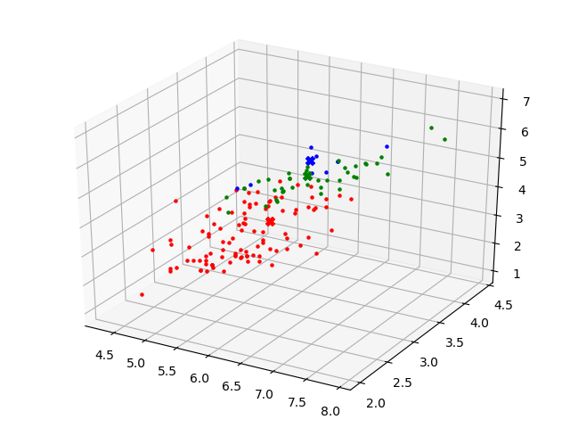
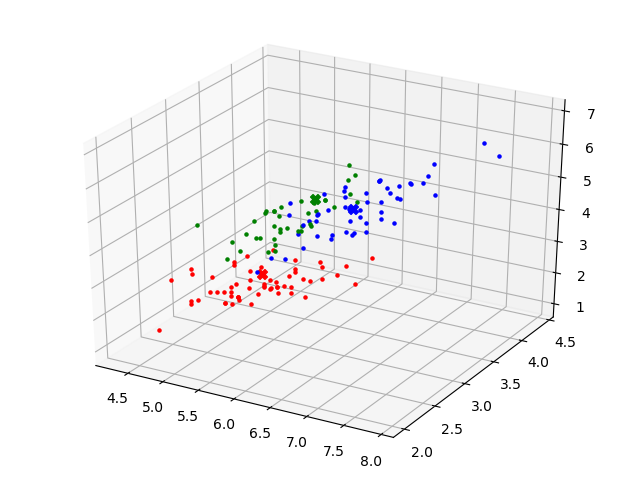
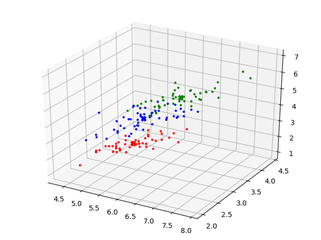
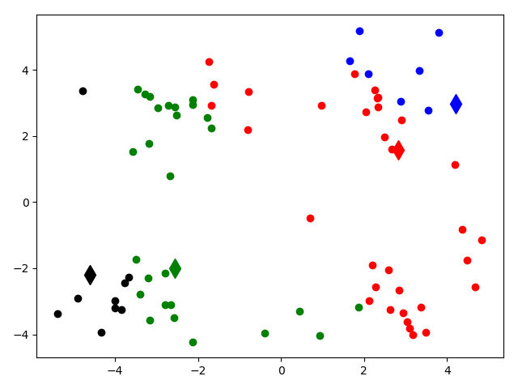
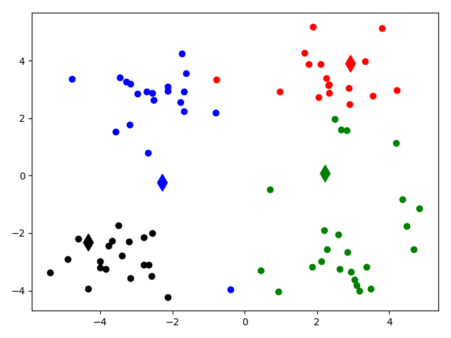
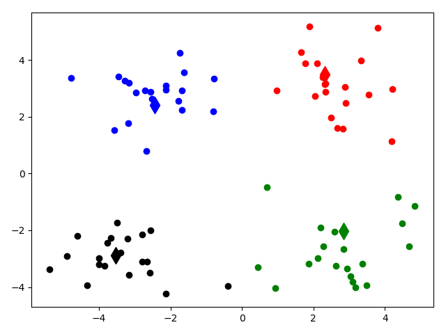
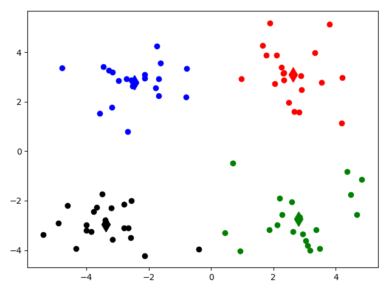

# k-means 聚类算法
- [k-means 聚类算法](#k-means-%E8%81%9A%E7%B1%BB%E7%AE%97%E6%B3%95)
  - [结果](#%E7%BB%93%E6%9E%9C)
    - [1. 鸢尾花卉聚类结果](#1-%E9%B8%A2%E5%B0%BE%E8%8A%B1%E5%8D%89%E8%81%9A%E7%B1%BB%E7%BB%93%E6%9E%9C)
    - [2. 随机二维散点聚类结果](#2-%E9%9A%8F%E6%9C%BA%E4%BA%8C%E7%BB%B4%E6%95%A3%E7%82%B9%E8%81%9A%E7%B1%BB%E7%BB%93%E6%9E%9C)

使用UCI的鸢尾花卉[数据集](http://archive.ics.uci.edu/ml/machine-learning-databases/iris/iris.data)

以及随机生成二维散点，[文件](dataset/dataSet.csv)

## 结果

### 1. 鸢尾花卉聚类结果

明显，该数据集有**3**个种类，每条数据有**4**个特征值。因此我们将k设置为3，并抽取出3个特征值做三维结果输出，如下：

| times | cost | centroid |
| :------: | :------: | :------: |
| 1 | 239.9920798388497 | [6.1, 2.8, 4.0, 1.3, 1.0], [6.2, 3.4, 5.4, 2.3, 2.0], [6.5, 3.0, 5.5, 1.8, 2.0] |
| 2 | 200.68184546471642 | [5.4, 3.0, 2.8, 0.7, 0.5], [6.6, 2.9, 5.5, 1.9, 1.9], [6.3, 3.2, 5.5, 2.3, 2.0] |
| 3 | 170.86252107740796 | [5.2, 3.1, 2.3, 0.5, 0.3], [6.6, 2.9, 5.2, 1.7, 1.6], [6.0, 3.0, 5.1, 2.0, 1.8] |
| 4 | 128.44703223641883 | [5.0, 3.2, 1.7, 0.3, 0.1], [6.7, 2.9, 5.2, 1.7, 1.5], [5.8, 2.8, 4.7, 1.6, 1.5] |
| 5 | 104.09742459312062 | [5.0, 3.4, 1.4, 0.2, 0.0], [6.8, 3.0, 5.6, 2.0, 1.8], [5.8, 2.7, 4.3, 1.4, 1.2] |
| 6 | 101.87504647284948 | [5.0, 3.4, 1.4, 0.2, 0.0], [5.9, 2.7, 4.3, 1.3, 1.1], [6.7, 3.0, 5.6, 2.0, 2.0] |
| 7 | 100.94812011537232 | [5.0, 3.4, 1.4, 0.2, 0.0], [5.9, 2.7, 4.3, 1.3, 1.0], [6.6, 3.0, 5.6, 2.0, 2.0] |
| 8 | 100.4376640571452 | [5.0, 3.4, 1.4, 0.2, 0.0], [5.9, 2.7, 4.2, 1.3, 1.0], [6.6, 3.0, 5.6, 2.0, 2.0] |
| 9 | 100.20899301603114 | [5.0, 3.4, 1.4, 0.2, 0.0], [5.9, 2.7, 4.2, 1.3, 1.0], [6.6, 2.9, 5.5, 2.0, 2.0] |
| 10 | 100.07779193965868 | [5.0, 3.4, 1.4, 0.2, 0.0], [5.9, 2.7, 4.2, 1.3, 1.0], [6.6, 2.9, 5.5, 2.0, 2.0] |
| 11 | 100.07779193965868 | [5.0, 3.4, 1.4, 0.2, 0.0], [5.9, 2.7, 4.2, 1.3, 1.0], [6.6, 2.9, 5.5, 2.0, 2.0] |

第一次：

第三次：

第五次：

第七次：

第九次：

第十一次：

---

### 2. 随机二维散点聚类结果

| times | cost | centroid |
| :------: | :------: | :------: |
| 1 | 231.472596499122 | [2.8, 1.6], [4.2, 2.9], [-2.5, -2.0], [-4.6, -2.2] |
| 2 | 183.8034406488179 | [2.9, 3.9], [-2.2, -0.2], [2.2, 0.0], [-4.3, -2.3] |
| 3 | 101.44429673201277 | [2.3, 3.4], [-2.4, 2.4], [2.8, -2.0], [-3.5, -2.8] |
| 4 | 93.5743547738006 | [2.6, 3.1], [-2.4, 2.7], [2.8, -2.7], [-3.3, -2.9] |
| 5 | 93.5743547738006 | [2.6, 3.1], [-2.4, 2.7], [2.8, -2.7], [-3.3, -2.9] |

第一次:

第二次:

第三次:

第四次:

